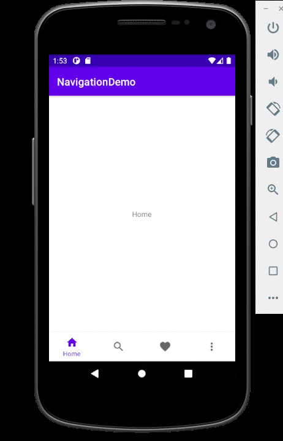

### Android Kotlin Tabs Navigation Demo

---

Tabs navigation using kotlin view binding syntax.

Steps

1. add

   ```
   buildFeatures {
       viewBinding = true
   }
   ```

   inside the `module.app`(build.gradle file) to enable the view binding in the project

2. create `BottomNavigationView` form the `palette`

3. create a `navigation` resource directory by right-click on the `res` folder -> `new` -> `Android Resource Directory `.
   select `navigation` under the resource type dropdown.

4. add the destination fragments like

   - `home fragment`
   - `search fragment`
   - `favorite fragment`
   - `more fragment`

5. Add `menu` resource directory by right-click on the `res` folder -> `new` -> `Android Resource Directory`.select `menu` under the resource type dropdown. Add Menu Items and add corresponding `title` and `icon` attributes.

⚠️ Make sure `item id` in the menu `item` is same as the `fragment id` in the navigation graph

6. change the fragment code to the viewBinding syntax
7. change mainactivity code to viewBinding and add the navController.


